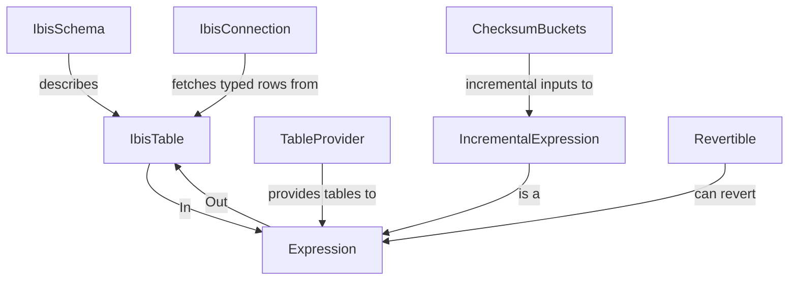

# ibis-typing

[](https://github.com/FortnoxAB/ibis-typing/actions/workflows/ci.yml)
[](LICENSE)

A typed framework for writing [Ibis](https://ibis-project.org/) dataframe expressions — with full IDE support, static analysis, and property-based testing.

[Ibis](https://ibis-project.org/) is a portable Python dataframe library (DSL) that runs on DuckDB, Polars, Trino, BigQuery, and more. **ibis-typing** layers a type-safe schema system on top of it, so your transforms carry type information end-to-end.

## Installation

```bash
pip install ibis-typing
```

```bash
uv add ibis-typing
```

After installation, run the type-patch step once to inject typed overloads into your installed `ibis` package:

```bash
python -m ibis_typing.type_patch
```

## Quick start

### 1. Define schemas

```python
from attrs import frozen
from ibis_typing import IbisSchema
from ibis_typing import it

@frozen
class Transaction(IbisSchema):
    date: it.Date = None
    amount: it.Float64 = None
    category: it.String = None
```

### 2. Define a typed expression

```python
from ibis_typing import Expression, IbisTable, this
from ibis_typing.ibis_utils import Select, Aggregate

@frozen
class MonthlyAmounts(Expression):
    month: it.Date = None
    amount: it.Float64 = None

    @classmethod
    def from_expression(cls, inputs: IbisTable[Transaction]) -> IbisTable["MonthlyAmounts"]:
        cols = inputs.cols
        table = (
            inputs.table
            @ Select(expr={"month": this[cols.date].truncate("M")})
            @ Aggregate(by=["month"], sum=[cols.amount])
        )
        return cls.of(table)
```

> **Tip:** `IbisSchema` classes for your `Expression` outputs can be generated automatically using `ibis_typing.schema_writer`. The code is backend-agnostic — schemas are derived from abstract Ibis table schemas, so no live backend is required.

### 3. Evaluate against a backend

```python
from ibis_typing import IbisConnection

conn = IbisConnection()
results: list[MonthlyAmounts] = conn.evaluate(MonthlyAmounts, transactions_table)
```

### 4. Test with Hypothesis

pytest fixtures are registered automatically — no `conftest.py` needed.

```python
from hypothesis import given, strategies as st
from ibis_typing.hypothesis import strategy_for

@given(st.lists(strategy_for(Transaction), min_size=1))
def test_monthly_amounts(evaluate_table, transactions):
    actual, expected = evaluate_table(MonthlyAmounts, transactions)
    assert sorted(actual) == sorted(expected)
```

## Core concepts



| Class | Purpose |
|---|---|
| `IbisSchema` | Base class for typed table schemas (attrs frozen dataclass) |
| `IbisTable[S]` | Generic typed wrapper around `ibis.Table` |
| `Expression` | Abstract base for typed ibis transforms |
| `IbisConnection` | Typed backend wrapper: `fetch_table()`, `evaluate()`, `read/write_parquet()` |
| `IncrementalExpression` | Expression that only re-runs for changed input buckets |
| `ChecksumBuckets` | Checksum-based incremental input tracking |
| `RevertibleTableExpression` | Transform that can undo itself back to the original schema |

## Type aliases

Declare schema fields using column-type aliases from `ibis_typing.it`:

```python
from ibis_typing import it

it.Int8, it.Int16, it.Int32, it.Int64
it.Float32, it.Float64
it.Boolean
it.String, it.Binary
it.Decimal
it.Date, it.Time, it.Timestamp
it.UUID, it.JSON
it.Array[it.Int64]
it.Map[it.String, it.Float64]
it.Struct[MyTypedDict]
```

## Table operations

Use the infix `@` operator for composable, typed table transforms:

```python
from ibis_typing.ibis_utils import Select, Aggregate, InnerJoin, LeftJoin

@frozen
class InputSchema(IbisSchema):
    a: it.Float64 = None
    b: it.Float64 = None
    category: it.String = None
    amount: it.Float64 = None
    key: it.String = None

cols = InputSchema.cols

table @ Select(cols.a, cols.b, expr={"c": this[cols.a] + this[cols.b]})
table @ Aggregate(by=[cols.category], sum=[cols.amount])
table @ InnerJoin(other_table, keys=[cols.key])
```

## Pytest fixtures

The following fixtures are auto-registered via the pytest plugin entry point (no `conftest.py` needed):

| Fixture | Purpose |
|---|---|
| `evaluate_table` | Runs an `Expression`, returns `(actual, expected)` row lists |
| `fetch_table` | Fetches rows from an `IbisTable` via DuckDB |
| `ibis_connection` | Provides a DuckDB-backed `IbisConnection` |

## Extras

- **`ibis_typing.type_patch`** — patches installed ibis with typed `@overload` stubs for `ibis.ifelse`, `ibis.cases`, `ibis.coalesce`, etc.
- **`ibis_typing.schema_writer`** — code-gen: write `IbisSchema` `.py` files from `Expression` output schemas
- **`ibis_typing.plot`** — plots the dependency graph of an `Expression` using matplotlib/graphviz
- **`ibis_typing.custom`** — custom ibis operations: `DateAddMonth`, `DateAddDay`, `ColumnChecksum`, `JsonParse`, `JsonFormat`, `UUIDFromInt`, `LuhnCheck`

## Contributing

```bash
git clone https://github.com/FortnoxAB/ibis-typing
cd ibis-typing
uv sync --all-extras
uv run python -m ibis_typing.type_patch
make test
```

Pull requests welcome. Please run `make` before submitting.

## License

[MIT](LICENSE)
