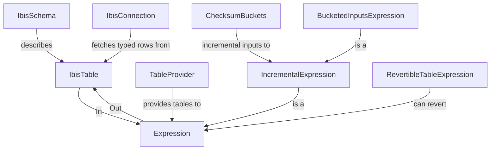

# ibis-typing

[](
https://pypi.org/project/ibis-typing/)
[](
LICENSE)
[](
https://pypi.org/project/ibis-typing/)
[](
https://github.com/FortnoxAB/ibis-typing/actions/workflows/ci.yml)
[](
https://codecov.io/gh/FortnoxAB/ibis-typing)
[](
https://github.com/astral-sh/ruff)
[](
https://github.com/astral-sh/ty)
[](
https://github.com/astral-sh/uv)

A typed framework for writing [Ibis](https://ibis-project.org/) dataframe expressions — with full IDE support, static
analysis, and property-based testing.

[Ibis](https://ibis-project.org/) is a portable Python dataframe library (DSL) that runs on DuckDB, Polars, Trino,
BigQuery, and more. **ibis-typing** layers a type-safe schema system on top of it, so your transforms carry type
information end-to-end.

## Installation

```bash
pip install ibis-typing
```

```bash
uv add ibis-typing
```

After installation, run the type-patch step once to inject typed overloads into your installed `ibis` package:

```bash
python -m ibis_typing.type_patch
```

## Quick start

### 1. Define schemas

```python
from attrs import frozen
from ibis_typing import IbisSchema, it


@frozen
class Transaction(IbisSchema):
    date: it.Date = None
    amount: it.Float64 = None
    category: it.String = None
```

### 2. Define a typed expression

```python
from ibis_typing import Expression, IbisTable, this, it


@frozen
class MonthlyAmounts(Expression):
    month: it.Date = None
    amount: it.Float64 = None

    @classmethod
    def from_expression(cls, inputs: IbisTable[Transaction]):
        cols = inputs.cols
        table = (
            inputs.table
            @ it.Select(expr={"month": this[cols.date].truncate("M")})
            @ it.Aggregate(by=["month"], sum=[cols.amount])
        )
        return cls.of(table)
```

> **Tip:** `IbisSchema` classes for your `Expression` outputs can be generated automatically using
`ibis_typing.schema_writer`. The code is backend-agnostic — schemas are derived from abstract Ibis table schemas, so no
> live backend is required.

### 3. Evaluate against a backend

```python
from datetime import date

from ibis_typing import IbisConnection, evaluator

conn = IbisConnection()  # defaults to DuckDB in-memory
transactions = Transaction.of_rows(
  [Transaction(date=date(2024, 1, 15), amount=100.0, category="A")]
)
monthly_amounts = evaluator.from_expression(MonthlyAmounts, transactions)
results: list[MonthlyAmounts] = list(conn.fetch_table(monthly_amounts))
```

### 4. Test with Hypothesis

pytest fixtures are registered automatically — no `conftest.py` needed.

```python
from hypothesis import given, strategies as st

from ibis_typing import utils
from ibis_typing.hypothesis import strategy_for


@given(transactions=st.lists(strategy_for(Transaction), min_size=1))
def test_monthly_amounts(evaluate_table, transactions):
    reference_output = utils.group_by(transactions, key=lambda t: t.date.replace(day=1))
    monthly_amounts = [
      MonthlyAmounts(month=month, amount=sum(t.amount for t in month_transactions))
      for month, month_transactions in reference_output.items()
    ]

    # Get evaluated expression rows together with expected, both as sorted lists
    actual, expected = evaluate_table(MonthlyAmounts, [*transactions, *monthly_amounts])

    assert actual == expected
```

## Core concepts



| Class                       | Purpose                                                                      |
|-----------------------------|------------------------------------------------------------------------------|
| `IbisSchema`                | Base class for typed table schemas (attrs frozen dataclass)                  |
| `IbisTable[S]`              | Generic typed wrapper around `ibis.Table`                                    |
| `Expression`                | Abstract base for typed ibis transforms                                      |
| `TableMethod`               | Extension method on `ibis.Table` returning another Table                     |
| `IbisConnection`            | Typed backend wrapper: `fetch_table()`, `evaluate()`, `read/write_parquet()` |
| `BucketedInputsExpression`  | Expression that only re-runs for changed input buckets                       |
| `ChecksumBuckets`           | Checksum-based incremental input tracking                                    |
| `RevertibleTableExpression` | Transform that can undo itself back to the original schema                   |

## Type aliases

Declare schema fields using column-type aliases from `ibis_typing.it`:

```python
from ibis_typing import it

it.Int8, it.Int16, it.Int32, it.Int64
it.Float32, it.Float64
it.Boolean
it.String, it.Binary
it.Decimal
it.Date, it.Time, it.Timestamp
it.UUID, it.JSON
it.Array[it.Int64]
it.Map[it.String, it.Float64]
it.Struct[MyTypedDict]
```

## Table operations

Use the infix `@` operator for composable, typed table transforms via `TableMethod`:

```python
from ibis_typing import IbisSchema, IbisTable, this, it


@frozen
class InputSchema(IbisSchema):
    a: it.Float64 = None
    b: it.Float64 = None
    category: it.String = None
    amount: it.Float64 = None
    key: it.String = None


inputs: IbisTable[InputSchema] = ...
other_table: IbisTable = ...
cols = InputSchema.cols

table = InputSchema.of(
    inputs.table
    @ it.Select(cols.a, cols.b, expr={"c": this[cols.a] + this[cols.b]})
    @ it.Aggregate(by=[cols.category], sum=[cols.amount])
    @ it.InnerJoin(other_table.table, keys=[cols.key])
)
```

## Pytest fixtures

The following fixtures are auto-registered via the pytest plugin entry point (no `conftest.py` needed):

| Fixture           | Purpose                                                      |
|-------------------|--------------------------------------------------------------|
| `evaluate_table`  | Runs an `Expression`, returns `(actual, expected)` row lists |
| `fetch_table`     | Fetches rows from an `IbisTable`                             |
| `ibis_connection` | Provides a `IbisConnection` for relevant DB backends         |

## Extras

- **`ibis_typing.type_patch`** — patches installed ibis with typed `@overload` stubs for `ibis.ifelse`, `ibis.cases`,
  `ibis.coalesce`, etc.
- **`ibis_typing.schema_writer`** — code-gen: write `IbisSchema` `.py` files from `Expression` output schemas
- **`ibis_typing.plot`** — plots the dependency graph of an `Expression` using matplotlib/graphviz
- **`ibis_typing.custom`** — custom ibis operations: `DateAddMonth`, `DateAddDay`, `ColumnChecksum`, `JsonParse`,
  `JsonFormat`, `UUIDFromInt`, `LuhnCheck`

## Contributing

```bash
git clone https://github.com/FortnoxAB/ibis-typing
cd ibis-typing
make
```

Pull requests welcome. Please run `make` before submitting.

## License

[MIT](LICENSE)
